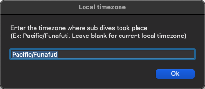
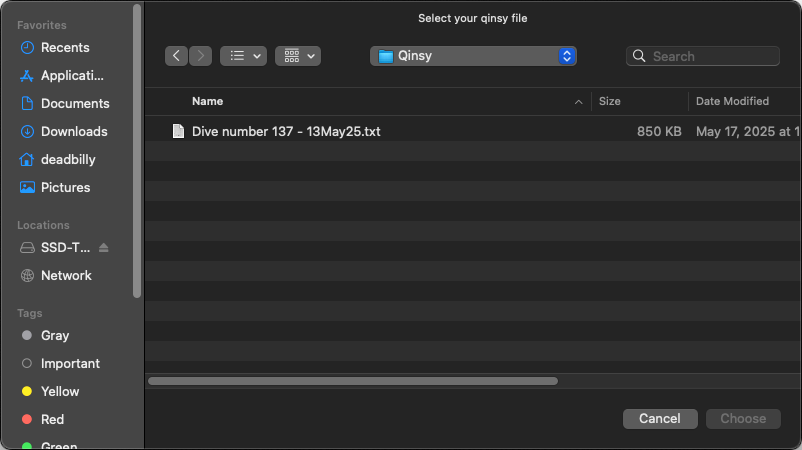
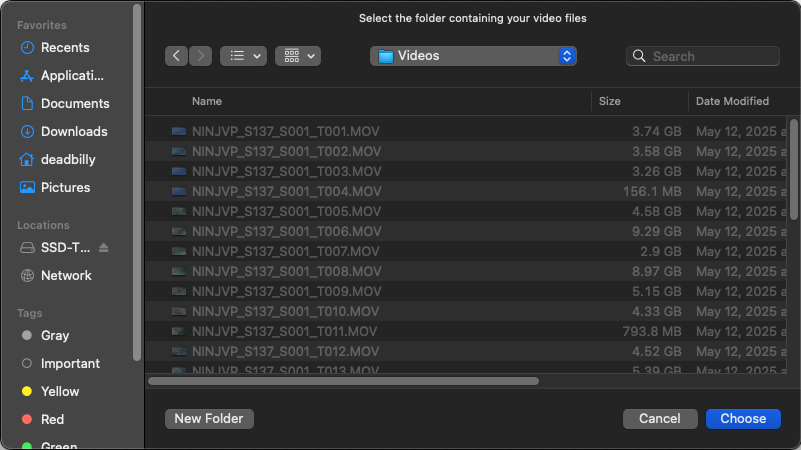
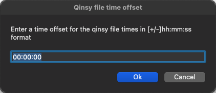
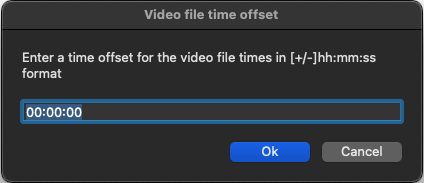
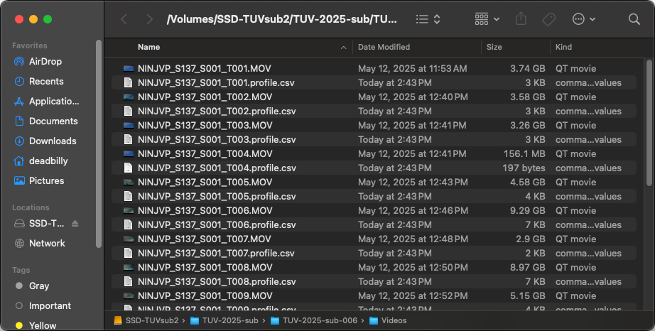

# Pristine Seas submersible video clip metadata widget

This tool allows you to quickly extract and associate dive metadata (times, depths, GPS points, etc.) with video clips taken from the Argonauta's primary camera. It uses the Qinsy-formatted data file and video creation times to generate data sheets, allowing you to easily place video clips within the context of a given dive.

# Installation and setup

## Supported platforms

### Mac

On Mac, there's an app ([`sub metadata.app`](#running-the-tool)) that provides a nice graphical interface wrapping all the underlying script that does the metadata extraction. Most of contents of this document refer to the wrapper tool.

### Windows

The graphical wrapper tool won't work on Windows, but you should be able to [run the underlying R script directly](#advanced-usage) inside of Rstudio.

## Installing

Regardless of which platform you're one, the overall installation process is more or less the same: clone the github repository, make sure R package dependencies are installed, and make sure you have access to the `exiftool` executable.

### Dependencies

This tool requires two things to run: an [R](https://www.r-project.org/) installation, and [exiftool](https://exiftool.org/). Both tools can be installed via the links provided. To configure the sub metadata tool, you'll need to know the locations of the `Rscript` and `exiftool` executables (typically something like `/usr/local/bin/Rscript` and `/usr/local/bin/exiftool`, depending on how you installed them).

To install the tool, clone this repository to your machine, and make sure it's located in the `Documents` directory inside your home directory (`~/Documents/clipdata`). You can do this by opening a terminal window and running the following commands:

```console
$ cd ~/Documents
$ git clone https://github.com/mhoban/clipdata.git
```

If you've installed `R` and `exiftool`, you should be able to get their executable locations like this:

```console
$ which Rscript
/usr/local/bin/Rscript
$ which exiftool
/opt/homebrew/bin/exiftool
```

Make sure you note these locations.

## Initial configuration

There's one annoying thing you'll have to do right after installing this tool, but you'll only have to do it once. Pop open a terminal window and do the following (assuming you've already done the `git clone` operation above):

```console
$ cd ~/Documents/clipdata
$ R
```

You should see some startup info from `R`, as well as something like the following (you may see some errors associatged with 'Bioconductor', but don't worry about that if you do):

```console
# Bootstrapping renv 1.0.7 ---------------------------------------------------
- Downloading renv ... OK
- Installing renv  ... OK

- Project '~/Documents/clipdata' loaded. [renv 1.0.7]
- None of the packages recorded in the lockfile are currently installed.
- Would you like to restore the project library? [y/N]:
```

At this point hit 'y' and then enter:

```console
- Would you like to restore the project library? [y/N]: y

The following package(s) will be updated:

# CRAN -----------------------------------------------------------------------
- bit           [* -> 4.6.0]
- bit64         [* -> 4.6.0-1]
- cli           [* -> 3.6.4]
- clipr         [* -> 0.8.0]
- cpp11         [* -> 0.5.2]
- crayon        [* -> 1.5.3]
- dplyr         [* -> 1.1.4]
- fansi         [* -> 1.0.6]
- fs            [* -> 1.6.6]
- generics      [* -> 0.1.3]
- getopt        [* -> 1.20.4]
...
...
...
```

If you don't see `Would you like to restore the project library?`, enter `renv::restore()` at the `>` prompt and continue as shown. You will see some more output about downloading and installing packages. After all that finishes (hopefully without errors), type `quit(save="no")` follwed by enter at the `>` prompt, and you should be done with the necessary configuration.

# Running the tool

Now that you've got the install & config out of the way, you can run the tool. Open Finder, go to `Documents` and then `clipdata`. Inside there, you should see `sub metadata.app` with (if everything worked), a little submarine icon. You can copy this app file to the desktop or `/Applications` or anywhere else that's convenient for you. Double clicking this app will run the tool.

The first time you launch the app, it'll ask you to confirm the location of the `Rscript` and `exiftool` executables (which you noted down from before, right?) as well as to optionally specify the sub dive timezone ([more info down here](#a-note-on-timezones)). If you don't need to change the defaults, you can just click through:




Next, you will be asked for the location of your Qinsy file. This is the text file (in Qinsy format) that contains all the metadata for the sub dive:



Then, it'll ask you for the location of your video files. In this case, you're choosing a directory rather than a file:



Then, it'll ask you if you need to adjust the times by some offset. This option is included because we ran into an issue where the times in the Qinsy file were consistently two hours ahead of the video creation times. You can probably just leave them with the defaults (`00:00:00`). It'll ask if you want to modify the Qinsy time or the video times:





After you hit `Ok` on this last dialog, you might not see anything happening for a little bit. Under the hood, the data is being crunched and spreadsheets are being made. Be patient! Once it finishes, you'll see the video directory you chose pop up, and it should contain the metadata you seek!



## Configuration

As mentioned above, the first time the tool is run, it'll prompt for you to enter a few configuration options. These are all stored in a file called `clipdata.json` in the folder `~/Documents/clipdata` (where this thing is meant to be installed). That file looks something like this:

```json
{
  "exiftool": "/opt/homebrew/bin/exiftool",
  "rscript": "/usr/local/bin/Rscript",
  "timezone": "Pacific/Funafuti",
  "configured": true
}
```

You can change any of these configuration values by editing this file directly, OR you can change `"configured": true` to `"configured": false` and the next time you run the tool it'll re-prompt for these values.

## A note on timezones
Times in the Qinsy file and video creation times are recorded *without* timezone info. As a result, unless you specify otherwise, this tool will assume that these (Quinsy/video) times are local to the computer it's being run on. When the CSV files are saved, these times are converted to UTC. This makes the data fields convenient to use wherever you are, but if you run the metadata tool in a different timezone from the one where the sub dive took place, times will be wrong (although the video files and Qinsy data will still sync up correctly).

For example, if you have a sub dive that took place in Tuvalu (UTC+12:00), but you're trying to retrieve video metadata in Hawai&#x02BB;i (UTC-10:00), a dive that was recorded in the video/Qinsy file as having started at 08:32 on 5/16/2025 will show up in the final metadata (which is UTC) as 18:32 on 5/16, when it should actually be 20:32 on the previous day.

The good news is, this is configurable! As mentioned above, the first time you run the tool, it'll ask you to enter the timezone where the sub dives took place. If you are running this in the same place as the sub dives, you can just leave it blank. Otherwise, enter a timezone in the `Olson` or `tz database` format, which is [described and listed here](https://en.wikipedia.org/wiki/List_of_tz_database_time_zones) (accepted values are listed in the `TZ Identifier` column in the table in that article).

## Advanced usage

Under the hood, this tool just launches an `R` script called `clipdata.R`. If you prefer, you can that script directly in `RStudio` (for instance, if you're on a Windows machine). In the `clipdata` folder, you'll find the `RStudio` project `clipdata.Rproj`. Open this file, and open the script `clipdata.R`. As mentioned above, if this is the first time you're opening it you'll want to execute `renv::restore()` somewhere, to make sure the necessary `R` package dependencies are installed.

To run the tool in `RStudio`, uncomment lines 89–114 in `clipdata.R` and modify the `script_args` variable to include the necessary info (time offsets, exiftool location, timezone, output filename, qinsy file, video file location, etc.). The code comments should explain where and how to edit those options. Then, you can just run the whole file (cmd+shift+enter on Mac), and it will retrieve and save all your video metadata.

You can also run `clipdata.R` directly from the command line. To see its options, do:

```console
$ ./clipdata.R --help
Usage: clipdata.R [options] <qinsy_file> <video_dir>

Options:
  -q QINSY-OFFSET, --qinsy-offset=QINSY-OFFSET
    Offset ([+/-]hh:mm:ss) to modify dive time [default: 00:00:00]

  -v VIDEO-OFFSET, --video-offset=VIDEO-OFFSET
    Offset ([+/-]hh:mm:ss) to modify video time [default: 00:00:00]

  -g VIDEO-GLOB, --video-glob=VIDEO-GLOB
    Glob (wildcard) to specify video files (must be quoted if passing in the shell)

  -t TIMEZONE, --timezone=TIMEZONE
    Timezone of video/qinsy times (in Olson/tz format), blank is computer's local timezone

  -x EXIFTOOL, --exiftool=EXIFTOOL
    Path to exiftool executable [default: exiftool]

  -r, --rename
    Rename video files [default: FALSE]

  -p, --save-profile
    Save dive profile data for each video file [default: FALSE]

  -F RENAME-FORMAT, --rename-format=RENAME-FORMAT
    Video file renaming format string [default: %f_%d]

  -o OUTPUT, --output=OUTPUT
    Output filename [default: video_metadata.csv]

  -h, --help
    Show this help message and exit
```

# Metadata output

This tool produces two types of output files, which are created in the directory where your video files live: a summary metadata file and per-clip dive profiles. GPS points are given in decimal degrees (rather than that annoying degrees-decimal minutes format that so many things seem to love to use) and dates/times are recorded in [ISO 8601](https://en.wikipedia.org/wiki/ISO_8601) format. **Note that unless you've specified otherwise, we assume that the computer you're running this tool on is in the same timezone as the sub was when it dove.** For more info on timezones, [see below](#a-note-on-timezones)

## `video_metadata.csv`

This is a spreadsheet that includes high-level information about each video file. It has the following columns:

| Column | Description |
| ------ | ---------|
| dive | Dive number from the Qinsy file |
| file | Video filename |
| start_depth | The dive depth at the time video recording started |
| end_depth | The dive depth at the time video recording ended |
| avg_depth | The average dive depth over the course of the video |
| start_lat | The GPS latitude at the start of the video |
| start_lon | The GPS longitude at the start of the video |
| end_lat | The GPS latitude at the end of the video |
| end_lon | The GPS longitude at the end of the video |
| avg_temp | The average water temperature (&deg;C) over the course of the video |G
| start | The start date and time for the video (in [ISO 8601](https://en.wikipedia.org/wiki/ISO_8601) date/time format, in UTC)
| end | The ending date and time for the video (in [ISO 8601](https://en.wikipedia.org/wiki/ISO_8601) date/time format, in UTC)
| duration | The length of the video clip (hh:mm:ss) |

## `<video filename>.profile.csv`

These files contain dive profile data for each individual video clip (recorded at one-second intervals). They have the following columns:

| Column | Description |
| ------ | -------- |
| file | Video filename |
| dive | Dive number from the Qinsy file |
| time | Data point sample time (in [ISO 8601](https://en.wikipedia.org/wiki/ISO_8601) date/time format, in UTC) |
| depth | Sampled dive depth |
| temp | Sampled water temperature (&deg;C) |
| lat | GPS latitude |
| lon | GPS longitude |


